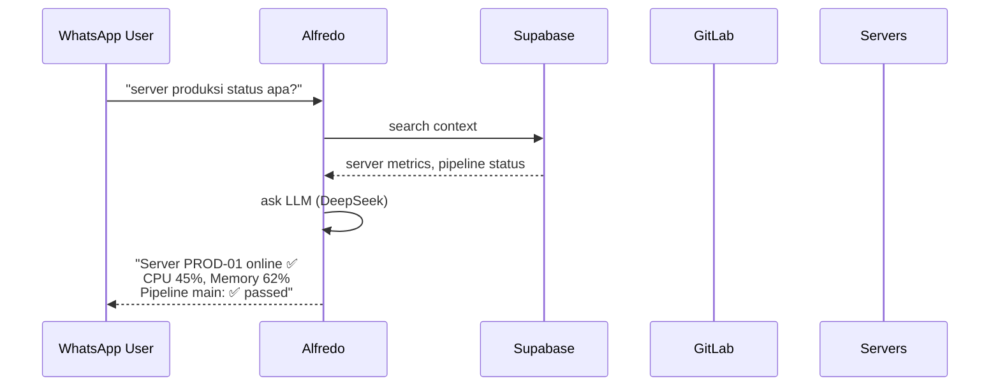

# Alfredo — DevOps AI Companion for WhatsApp

> 🤖 Your always-on DevOps buddy that answers server status questions so you can sleep.

**v1.0.1** — Production-ready. Monitoring 40+ servers in real time via bash daemon.

Alfredo is an AI-powered WhatsApp chatbot that monitors **40+ servers**, **600+ GitLab repos**, and responds to questions in Indonesian. No more 3 AM wake-up calls — Alfredo answers what failed, why it failed, and how long it's been down.



## ✨ Features

### 💬 Natural WhatsApp Interface
- **Multi-provider**: Fonnte (recommended for Indonesia), Meta WhatsApp Cloud API, or self-hosted Evolution API
- **Group chat aware**: Only responds when mentioned
- **Group chat support**: Fonnte + Evolution API groups
- **Bot modes**: Normal hours (06:00–12:00 WIB), Extended AI (24/7), or Human Mode (silent — answers nothing)

### 🖥️ Real-Time Server Monitoring
- **Per-server daemon**: 3-second interval bash script, no Node.js dependency
- **Systemd service**: Auto-restart on failure, logs to journal
- **Metrics**: CPU (delta from `/proc/stat`), Memory (`/proc/meminfo`), Disk (`df`), Uptime
- **Docker containers**: Auto-detected, shows status + last 100 lines of error logs
- **Stale detection**: 10-second threshold, Offline badge with dimmed metrics

### 🔍 GitLab Pipeline Intelligence
- **Webhook-driven**: Receives pipeline events, stores status in real-time
- **Auto error fetch**: On pipeline failure, fetches last 2KB of job log → stored for AI analysis
- **Bulk webhook setup**: CLI tool to create project-level webhooks for entire GitLab groups
- **Group support**: Distinguishes duplicate repo names across different GitLab groups

### 🤖 Zero-Hallucination AI
- **Only answers from DB**: All responses grounded in real-time Supabase data
- **Fallback without LLM call**: Empty context → friendly message, no wasted API credits
- **Ambiguity detection**: Same repo name across groups → asks for clarification before answering
- **WIB timestamps**: All times converted to Asia/Jakarta before reaching LLM

### 🎛️ Dashboard
- **Donut charts**: Servers & pipeline success rates with side-by-side responsive layout
- **Real-time status cards**: 2-second polling via Supabase Realtime, stable sort order
- **Server management**: Add/edit/remove servers, copy-paste daemon setup commands
- **Override notes**: Add human notes to servers (e.g., "maintenance until 2 AM")
- **AI settings**: Switch between DeepSeek/OpenAI/Gemini/Ollama, configure active hours, manage bot mode
- **Contact management**: Whitelist page with avatar cards, search, bulk import, and per-contact active/inactive toggle
- **Encrypted secrets**: API keys AES-256-GCM encrypted, masked on read

### 🌐 Cloud-Native Stack
- **Vercel serverless**: Zero cold starts, global edge
- **Supabase**: PostgreSQL + Auth + Realtime — no self-hosted DB needed
- **OpenAI-compatible LLM API**: DeepSeek (default), OpenAI, Gemini, Ollama Cloud — all use raw `fetch`

## 💬 Usage Examples

### Asking About Server Status

```
You: server produksi status apa?

Alfredo: Halo! 🤖 Berikut status server produksi:

🖥️ PROD-01 — Online ✅
  CPU: 23.4% | Memory: 61.2% | Disk: 45%
  Uptime: 14.5 jam

🖥️ PROD-02 — Online ✅
  CPU: 8.7% | Memory: 54.8% | Disk: 32%
  Uptime: 7.2 jam

Semua server produksi online dan dalam kondisi normal.
```

### Asking About Pipeline Failures

```
You: pipeline frontend-dashboard gagal, errornya apa?

Alfredo: Halo! 🤖 Pipeline frontend-dashboard terakhir gagal:

Pipeline: main (branch)
Status: ❌ failed
Error:
  ERROR: npm run build failed
  Module not found: Can't resolve '@/components/dashboard/Chart'
  at ModuleResolver.resolve (node:internal/modules/cjs/loader:1084:19)

Looks like ada import yang missing — file Chart.tsx belum ada atau udah di-move. Coba check import path-nya ya.
```

### Asking About Docker Containers

```
You: di server DEV-SCBD ada container yang mati?

Alfredo: Halo! 🤖 Di server DEV-SCBD-HABITAT:

🐳 Running (5):
  - nginx-proxy (Up 3d 2h)
  - api-gateway (Up 3d 2h)
  - postgres-db (Up 3d 2h)
  - redis-cache (Up 3d 2h)
  - app-frontend (Up 14h)

🐳 Exited (1):
  - cron-scheduler (exit_code=137, OOM killed)
    Last log: "JavaScript heap out of memory"

Container cron-scheduler mati karena OOM. Mungkin perlu increase memory limit atau optimize script-nya.
```

### Ambiguity Detection

```
You: pipeline backend-api gimana?

Alfredo: Halo! 🤖 Ada 2 project dengan nama backend-api:

1. group-a/backend-api — Pipeline main: ✅ passed (2 jam lalu)
2. group-b/backend-api — Pipeline main: ❌ failed (15 menit lalu)

Maksudnya backend-api yang mana? Group A atau Group B?
```

### Short Greetings (No LLM Call)

```
You: pagi

Alfredo: Selamat pagi! 🌅 Ada yang bisa saya bantu terkait server atau pipeline?
```

### Group Chat

```
(in WhatsApp group)
Budi: @alfredo server dev status?

Alfredo: Halo Budi! 🤖 Server DEV-01 online ✅, CPU 12%, Memory 48%
```

### Human Mode

```
You: halo

Alfredo: (no reply — bot is silent in Human Mode)
```

### Dashboard Usage

| Page | What You Do |
|---|---|
| `/dashboard` | View real-time server metrics + pipeline status at a glance |
| `/dashboard/override` | Add/edit/remove servers, leave notes ("maintenance until 2 AM"), get daemon setup commands |
| `/dashboard/logs` | Browse all WhatsApp conversations between PMs and Alfredo |
| `/dashboard/settings` | Switch AI provider, enter API keys, set bot mode (Normal/Extended/Human), configure active hours, save GitLab PAT |
| `/dashboard/whitelist` | Add/remove PM phone numbers, toggle active/inactive per contact, bulk import |

## 🏗️ Architecture

```
┌─────────────┐     ┌──────────────────┐     ┌──────────────┐
│  GitLab     │────▶│ /api/webhook/    │────▶│  Supabase    │
│  Webhooks    │     │ gitlab           │     │  PostgreSQL   │
└─────────────┘     └──────────────────┘     │  + Realtime   │
                                             └──────────────┘
┌─────────────┐     ┌──────────────────┐           ▲
│  Servers    │────▶│ /api/server-ping │───────────┘
│  (daemon)   │     │                  │
└─────────────┘     └──────────────────┘
                                              ▲
┌─────────────┐     ┌──────────────────┐     │
│  WhatsApp   │────▶│ /api/webhook/    │─────┘
│  PMs        │     │ {fonnte/meta/     │
└─────────────┘     │  evolution}      │
                    └──────────────────┘
                              │
                              ▼
                       ┌──────────────┐
                       │  DeepSeek   │
                       │  (or any LLM)│
                       └──────────────┘
```

## 🚀 Quick Start

### Prerequisites
- Node.js 18+ and npm
- A Supabase project ([Create one free](https://supabase.com))
- A DeepSeek API key ([Get from platform.deepseek.com](https://platform.deepseek.com))
- A Fonnte account ([Register at fonnte.com](https://fonnte.com))

### 1. Install

```bash
git clone https://github.com/ijalalfr/alfredo.git
cd alfredo
npm install
cp .env.example .env.local
```

### 2. Configure

Edit `.env.local`:

```env
# Supabase — from supabase.com → Settings → API
NEXT_PUBLIC_SUPABASE_URL=https://your-project.supabase.co
NEXT_PUBLIC_SUPABASE_ANON_KEY=eyJ...
SUPABASE_SERVICE_ROLE_KEY=eyJ...

# Encryption key — generate with: openssl rand -hex 32
ENCRYPTION_KEY=your-32-byte-hex-key

# Messaging — Fonnte recommended for Indonesia
WA_PROVIDER=fonnte
FONNTE_API_KEY=your-fonnte-api-key

# AI — DeepSeek default
AI_PROVIDER=deepseek
DEEPSEEK_API_KEY=sk-...
```

### 3. Database Setup

Run in Supabase SQL Editor (`supabase.com → your project → SQL Editor`):

```sql
-- Run the full schema (tables, RLS policies, trigram indexes)
\i supabase/schema.sql

-- Run migrations
\i supabase/migrations/001_add_columns.sql
\i supabase/migrations/002_add_group_support.sql
\i supabase/migrations/003_add_bot_mode.sql
\i supabase/migrations/004_add_metrics.sql
\i supabase/migrations/005_server_name_update_cascade.sql
\i supabase/migrations/006_add_whitelist_active.sql

-- Disable RLS on app_settings (admin-only table)
ALTER TABLE app_settings DISABLE ROW LEVEL SECURITY;
```

### 4. Start

```bash
npm run dev
# → http://localhost:3000
```

Login at `/login`, then go to `/dashboard`.

## 📡 Setting Up Webhooks

### Fonnte (Recommended)

1. Go to [fonnte.com](https://fonnte.com) → Dashboard → Webhook
2. Set URL to `https://your-domain.com/api/webhook/fonnte`
3. Save

### GitLab

**Option A — Bulk setup (for 600+ repos):**

```bash
GITLAB_PAT=glpat-xxxx \
GITLAB_WEBHOOK_SECRET=your-secret \
GITLAB_GROUP_ID=12345 \
node scripts/setup-gitlab-webhooks.mjs
```

**Option B — Single group webhook (requires GitLab Premium):**

1. GitLab → Group → Settings → Webhooks
2. URL: `https://your-domain.com/api/webhook/gitlab`
3. Secret: `your-secret`
4. Trigger: **Pipeline events**

## 🖥️ Server Monitoring Setup

On each server, run the dashboard-generated setup commands:

```bash
# 1. Download daemon script (bash only, secrets embedded)
sudo curl -sL "https://your-domain.com/api/daemon?secret=YOUR_SECRET" \
  -o /usr/local/bin/alfredo-daemon.sh && sudo chmod +x /usr/local/bin/alfredo-daemon.sh

# 2. Download systemd unit
sudo curl -sL "https://your-domain.com/api/daemon?type=service&secret=YOUR_SECRET" \
  -o /etc/systemd/system/alfredo-daemon.service

# 3. Enable and start
sudo systemctl daemon-reload && sudo systemctl enable --now alfredo-daemon
```

The daemon sends metrics every 3 seconds. Systemd auto-restarts if it crashes.

## 🤖 AI Provider Configuration

Alfredo supports **DeepSeek** (default), **OpenAI**, **Google Gemini**, and **Ollama Cloud**. Configure via:

1. **Dashboard** (`/dashboard/settings`) — click the provider card to switch, enter API key
2. **Environment variable** — `AI_PROVIDER=deepseek|openai|gemini|ollama`

Dashboard settings take priority over env vars.

## 🌏 Bot Configuration

| Setting | Default | Description |
|---|---|---|
| Active hours | 06:00–12:00 WIB | Bot only answers during these hours in Normal mode |
| Timezone | Asia/Jakarta | All timestamps displayed in WIB |
| Bot mode | Normal | Normal (hours), Extended (24/7 AI), Human (pass to Christian Rizaldi) |

## 📁 Project Structure

```
src/
├── app/
│   ├── api/
│   │   ├── daemon/                    # Generates bash daemon script
│   │   ├── server-ping/               # Receives metrics from servers
│   │   ├── servers/                   # Server CRUD
│   │   ├── settings/                  # AI config + GitLab PAT
│   │   ├── whitelist/                 # PM whitelist
│   │   └── webhook/
│   │       ├── gitlab/                # Pipeline events
│   │       ├── fonnte/                # Fonnte messages
│   │       ├── whatsapp/              # Meta WhatsApp
│   │       └── evolution/             # Evolution API
│   ├── (dashboard)/
│   │   ├── dashboard/                 # Main monitoring view
│   │   ├── logs/                      # Chat history
│   │   ├── override/                  # Server + note management
│   │   ├── settings/                  # AI + bot configuration
│   │   └── whitelist/                 # PM whitelist management
│   └── layout.tsx
├── components/
│   ├── realtime/                      # 2s polling + Supabase Realtime
│   └── ui/                            # shadcn/ui
└── lib/
    ├── supabase/                      # client / server / admin clients
    ├── messaging/                     # fonnte / meta / evolution providers
    ├── encryption.ts                  # AES-256-GCM
    ├── llm.ts                         # Multi-provider LLM
    ├── search.ts                      # Keyword search + ambiguity detection
    ├── bot-mode.ts                    # Normal / Extended / Human
    └── phone.ts                       # Indonesian phone normalization

scripts/
├── setup-gitlab-webhooks.mjs          # Bulk webhook creator
└── migrate.sh                         # Local DB migration runner

supabase/
├── schema.sql                         # Full schema
└── migrations/                        # Incremental migrations
```

## 🧪 Development

```bash
npm run dev        # Start dev server at localhost:3000
npm run build      # Production build
npm run lint       # ESLint
npm run start      # Serve production build
```

**Key dev notes:**
- All API routes have `export const dynamic = 'force-dynamic'` — required for Vercel
- All API routes set `Cache-Control: no-store` — prevents edge caching
- `createClient()` (browser Supabase) called inside `useEffect` — not at component top level
- Use `src/lib/supabase/admin.ts` for webhook routes — bypasses RLS

## 🐛 Debugging

**Daemon not sending metrics?**
```bash
# Check systemd logs
journalctl -u alfredo-daemon -f

# Manually test the ping endpoint
curl -X POST "https://your-domain.com/api/server-ping?secret=YOUR_SECRET" \
  -H "Content-Type: application/json" \
  -d '{"cpu": 50, "memory": 60, "disk": 25}'
```

**Dashboard shows 0% CPU/memory?**
1. Re-download the daemon script (it's updated via GitHub push)
2. Restart: `sudo systemctl restart alfredo-daemon`
3. Check: `journalctl -u alfredo-daemon --no-pager -n 20`

## 📜 Tech Stack

| Layer | Technology |
|---|---|
| Framework | Next.js 14 (App Router) |
| Language | TypeScript |
| Styling | Tailwind CSS v3 + shadcn/ui |
| Database | Supabase (PostgreSQL, Auth, Realtime) |
| Hosting | Vercel (Serverless) |
| AI | DeepSeek / OpenAI / Gemini / Ollama Cloud |
| Messaging | Fonnte / Meta WhatsApp / Evolution API |

## 📄 License

Private — all rights reserved. Contact Christian Rizaldi for access.

---

**Built with ☕ by Christian Rizaldi** — Alfredo v1.0.1